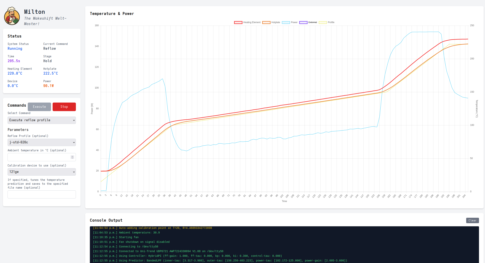

# Milton - The Makeshift Melt Master!

Milton is a web interface and set of utilities for controlling a solder reflow hotplate connected to various power supplies. Currently it supports bench power supplies with SCPI or Modbus support with plans to add support for other options as time, resources and information allow.

Join us on [Discord](https://discord.gg/dnQJEGFCZ9) to meet other people interested in DIY solder reflow hotplates, ask questions, make suggestions or discuss problems. You can also raise issues here and I'll take a look when I can.

Milton requires some playing around to set up and configure currently. Installation packages for Debian, Arch and a bare tarball installation should be coming soon.

## Features

* Bootstrappable - no need to hand-solder SMD components before you have a working reflow soldering solution.
* Support for SCPI and Modbus based power supplies.
* Web interface for ease of use and pretty graphs!
* Command line interface if a graphical UI is not your thing or not practical or you need to automate as part of a larger workflow.
* Real temperature control with various control algorithms available (bang-bang, feed-forward, PI and hybrid).
* Real temperature measurement without the need for an explicit temperature sensor.
* Temperature prediction models to provide noise reduction for control and to allow estimating the average temperature across your hotplate rather than for a single point that may or may not be representative of your load.
* Includes reflow profiles for tin-bismuth (SnBi) and tin-lead (SnPb) solder alloys based on JEDEC recommendations.
* Calibration via external temperature sensors if necessary to recalibrate the models for different hotplate assemblies.

## Requirements

* Linux computer with USB or RS-232 serial communications capabilities. This could include single board computers like a Raspberry PI or others.
* A variable DC power supply that supports remote control via RS-232 or USB-serial communications.
* SCPI or Modbus protocol support in your power supply.
* Perl 5 (see dependencies below)
* A [hotplate](#where-to-get-your-hotplate)

Note that power requirements depend on a lot. As a general rule, a 100mm x 100mm will need a power supply capable of 90W or more. 150W is desirable, but 90W can work reasonably well although may be a little slower - especially with heavier loads.

You will also need to match the resistance of your hotplate with your power supply. Your hotplate is basically just a copper resistor. It will dissipate whatever power you can put into it, but if the resistance is too high for your power supply's voltage capabilities or too low for it current capabilities, then you won't be able to utilize the full power output of your supply. Note that the resistance of your hotplate will increase with temperature and you generally want the highest power output at the top end of your reflow cycle. The resistance your most care about will be the resistance of the hotplate when its at your peak reflow temperature (around 220 celsius for tin-lead solder) rather than the value you measure at room temperature.

## Installation

Milton releases come in three flavours:

* a .deb package for Debian-derived distributions or anyone using the apt/dpkg package management system
* a .zst package for Arch-linux and derived distributions or anyone using the pacman package management system
* a .tar.xz file that you can just extract into your location of choice.

Simply download the flavour of package that you prefer. For the .deb or .zst packages, you can just use dpkg or pacman to install it. I don't think dpkg will automatically download and install the dependencies for you. Maybe there's a way to do that using apt - not sure at this point.

TODO: More installation and setup information required here!

## Using Milton

The command line interface uses the script `psc` to run commands. You can probably run something like:

```
psc reflow
```

TODO: Document more of the command-line options.

The web interface can be started with the command:

```
milton daemon
```

Milton is a mojolicious application that provides a web-based front end that wraps the command-line interface, so whether you run the `psc` directly or use the web interface, you're using the same code. I hope that the web interface is mostly self-explanatory, but for more advanced topics like calibration, documentation is a work in progress... or more realistically a work to be in progress. :)



### Temperature Measurement

Most temperature controlled systems use a heating element, burner or heat pump and a separate temperature sensor device. There are a lot of advantages to doing this, however some heating elements can also be used as a temperature sensor - with some caveats. This is how Milton currently works. The resistance of copper changes with temperature in a predictable and known way. In fact, this property of copper is sometimes used in a type of real, commercial/industrial temperature sensor called an RTD (Resistance Temperature Detector). These are just temperature dependent resistors made from metals such as copper or other metals/alloys with suitable properties. The copper trace on a PCB can be used as a heating element if made long and thin. If we know the resistance of the copper trace at one or more temperatures, then we can measure it's resistance to determine what its current temperature us.

Milton powers the heating element using a variable DC power supply that can be controlled via some communications interface. Currently, Milton supports SCPI and Modbus communciations over RS-232 or USB serial connections. Using this, we can read the output voltage and current. This allows us to calculate the resistance using Ohm's law. Note that there are some slight errors in these measurements due to things like lead and contact resistance, but these are negligible compared to the magnitude of the heating element resistance. They're also mostly taken care of during calibration. If we know the current temperature and the resistance of the heating element, we can use this to vary the supply voltage to send the right amount of power to get the hotplate temperature where we want it.

### Temperature Prediction

One of the drawbacks of using the heating element trace as both a heating element and a temperature sensor is that the heating element has low thermal mass and tends to vary more widely than the hotplate surface or the load on the hotplate (ie. your PCB to be reflowed). Using the heating element temperature reading directly is problematic and may be difficult to control - particularly if you're using an FR4 PCB as your hotplate. Prediction models allow us to use the measured heating element temperatures to predict what the hotplate surface temperature will be given the historical heating element temperature measurements that we've taken. With proper calibration, these models can be surprisingly accurate. The calibration provided in the release should work well for aluminimum PCBs that are assembled in a similar manner to the ones I have built. If this calibration is not working well for your particular assembly, Milton provides ways to re-calibrate the model to better reflect how your hotplate behaves.

It's also worth noting that loading the hotplate does change it's thermal behaviour.Testing so far has shown that this difference is not significant for the purpose of doing reliable solder reflow - at least with the hotplate assemblies described in this project. Feel free to experiment with new designs and let me know what you find!

If the release calibration is not working at all for you, the base predictor class - Milton::Predictor - does provide a pass-through predictor that simply gives the heating element temperature as the predicted hotplate temperature. For aluminium hotplate PCBs, this may work well enough to get you going until you can do your own calibration of the prediction model. For FR4 hotplate PCBs, this is probably not an option but if you're still using an FR4 hotplate, I highly recommend that you upgrade to aluminium. They seem to be superior in just about every way.

### Temperature Control

The control algorithms vary in their precision, need for calibration and sensitivity to mis-calibration. All of them rely on a properly calibrated temperature prediction model. Without good temperature prediction, you cannot hope to do good control. Note that raw measurements are often noisy which complicates control. You want a good prediction model for the noise filtering it provides.

There are three main control strategies currently available in Milton.

Bang-Bang control is the simplest. This works similar to the stove and oven in your kitchen. If the temperature is too low, we turn the heating element on. If the temperature is too high, we turn the heating element off - or something closely approximating off. Note that Milton always needs some current flowing through the heating element in order to measure its temperature, so the off state is really just a minimum power state. Bang-Bang control does support asymetric hysteresis, so you can specify how far above the temperature set-point the hotplate must be to turn off and how far below the temperature set-point the hotplate must be to turn on. This control strategy requires no calibration - other than a working temperature prediction model. It doesn't produce the smoothest temperature response but rather tends to oscillate around the temperature set-point by a few degrees celsius. It may also provide greater thermal and mechanical stress to your hotplate than other models due to the extreme on-off power levels that it sends into your hotplate. That said, I have not yet seen any appreciable deterioration in my aluminium hotplates after hundreds of reflow cycles and for a while this was the only control scheme I considered necessary. The results are more than adequate for solder reflow.

PI control (or PID as you may have heard it called) is a closed-loop feedback control scheme that measures the error between the desired temperature and the measured (or predicted temperature in our case) and uses that to detemine the control signal (ie. how much power to send to the hotplate) required to correct that error. The PID acronym comes from *Proportional*, *Integral* and *Differential* gains that the controller uses to produce the control signal. The proportional gain is applied to the error directly. The integral gain is applied to the integral of the error over time. The differential gain is applied to the derivative of the error over time. These three values are added together to produce the control output (ie. desired power level for the hotplate in our case). Thermal systems rarely need the differential gain or if they do use it, it's generally very small and often requires filtering of the derivative to avoid noise causing controllability problems. In our case, we simply ignore the differential term, so we really just have a PI controller with proportional and integral gains. These gains are adjustable parameters that may require some calibration, although there is a fairly wide range of values that will work reasonably well for any given hotplate. There are algorithms for calibrating these parameters - such as the well-known Ziegler-Nichols method, which Milton does not currently implement. Milton does have a calibration routine for the PI gains based on temperature prediction and a least-squared-error optimization, but the results so far were not impressive and so far the results with educated guesses have been better than what the optimization provided. The proportional gain generally gets the control into the ballpark, but with some offset error. The integral gain slowly corrects for this offset error, which brings the system closer to the desired state over time. PI controllers are good at adjusting to changing environmental conditions (eg. a load on the hotplate) but can also be prone to overshoot or undershoot when there are control changes required (eg. different rates of heating required). Proper selection of the gain values can improve this.

Feed-forward control requires a model for how the system responds to control inputs and then uses this model to estimate how much power is required to get from the current system state to the desired system state. It is the most sensitive to miscalibration, but when well-calibrated can often produce the smoothest, over/undershoot free temperature response you're likely to see. The downside is that feed-forward control is not great at adjusting for changes in environmental conditions like the PI controller. Feed-forward will generate higher power output commands in response to a load on the hotplate, but is unable to correct for the offset error that results. For most practical loads, this offset error is unlikely to be large enough to prevent reliable reflow, but a PCB loaded with components with high thermal mass may produce lower temperatures and/or require longer dwell time. This is why the feed-forward controller is implemented as a hybrid controller with the PI controller - HybridPI - so you can combine the best of both worlds. 

## Building Milton

TODO

## Where To Get Your Hotplate?

In theory, virtually any hotplate with a copper heating element should work but it was designed with PCB hotplates in mind. There are some example layouts for aluminium PCBs available in the [resources](resources) directory. You can also roll your own or get help from [Emmett](https://github.com/brettski74/Emmett) to build one to meet your needs.
