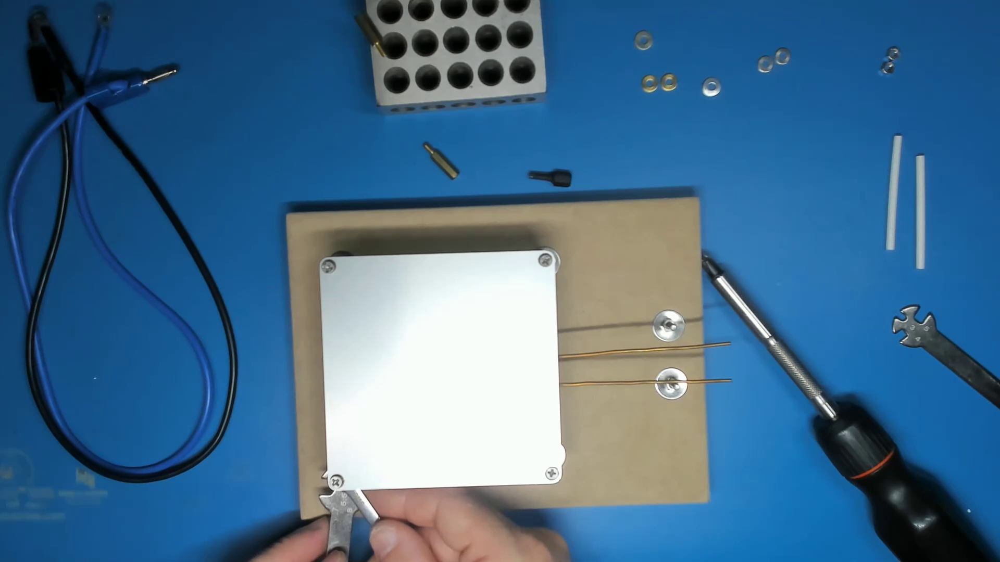

# Hotplate Assembly

## Disclaimer

This is just one way to potentially mount a solder reflow hotplate and is the way that I have
done it. I believe this provdes a relatively safe and reliable mounting solution. Note that
there is no guarantee that my approach is without risk. It is possible that I've overlooked
something. I don't claim to be an expert. Ultimately, this is a device that is intentionally
designed to get very hot and has the potential to cause injury and fire. If you think you have
a better way to do this, I'd love to hear about it and I'll be happy to incorporate
improvements or alternatives where they make sense. In any case, if you build one of these,
you do so at your own risk. I strongly recommend that you disconnect your hotplate from power
at any time that it is not in use and not under direct supervision so that if anything does
go wrong, someone is there to take action before it becomes a major catastrophe.

## Tools and Materials Needed

To assemble your hotplate you'll need the following items:

* 1 Hotplate PCB, setup with thermal fuse and power connections installed
* 1 [Hotplate Base](#hotplate-base)
* 6 M3 x 25mm cap screws
* 12 15mm M3 fender washers
* 10 M3 belleville washers
* 10 7/8/9mm M3 flat washers
* 6 M3 nuts
* 4 M3 x 20mm metal standoffs (stainless steel or brass)
* 4 M3 x 8mm machine screws
* 4 extra 7/8/9mm M3 flat washers (only required if using non-flat head screws such as pan head or truss head machine screws)
* high temperature insulation (eg. glassfibre tube, etc)
* 2 power leads with M3 ring terminals, 30-40cm in length, 14AWG stranded wire or equivalent, silicone insulation preferred

You should favour stainless steel hardware where possible, or brass if stainless steel is hard to find. For some
reason, stainless steel standoffs seem to be incredibly expensive or hard to find. Avoid carbon steel, even zinc-plated
or blackened carbon steel, etc. Steel rusts and when heated that process is accelerated. You want something that is
going to hold up during repeated heated and cooled over many, many cycles. Even with zinc electroplating, ordinary steel
hardware may rust in an undesirably short period of time.

Tools:

* Screwdrivers (which head depends on the screws you buy)
* Pliers
* 5.5mm spanner (wrench)
* 3/16" spanner (wrench) - optional

## Assembly

### 1. Secure the screw terminal screws in the base

Using a 25mm M3 cap screw, 2 fender washers and 1 M3 nut, secure the two screw terminal screws to the base. The nut should
be secured tightly in place with tools.

### 2. Secure the 4 hotplate leg screws in the base

Using 2 fender washers, 1 belleville washer and 1 M3 nut, secure each of the 4 cap screws that form the base of the legs
supporting the hotplate. The M3 nut should be done up finger tight only. The screw should feel firm, but be able to move
side-to-side slightly if pushed on firmly.

### 3. Add a second M3 nut onto the 4 mounting legs

Add an additional M4 nut onto each of the 4 mounting leg screws. Screw them down to near the bottom
be keep them loose. These will be used as lock nuts later

### 4. Screw the M3 standoffs onto the leg screws

Screw one of the M3 standoffs onto each of the 4 leg screws. Screw them several mm onto the leg screw
so that they are securely attached, but leave them loose. We will lock them later after levelling the
hotplate.

### 5. Loosely attach the hotplate PCB to the legs

Using 1 M3 machine screw, 1 washer and 1 belleville washer for each corner, attach the hotplate to the
4 legs. The flat washer should go against the underside of the hotplate. Notice that most washers have
one side where the edges are slightly rounded and the opposite side has a slight burr. Put the rounded
side against the PCB to avoid the possibility of that burr cutting through the solder mask and shorting
the heating element. It shouldn't, but just in case.

The narrow side of the belleville washer should be pointed downward toward the standoff. Belleville
washers have a slightly conical shape. They compress slightly under load which provides some pre-load
on the screw/nut threads and some allowance for thermal expansion during heating.

Leave the screws loose at this time. We will tighten things up after levelling the hotplate.

Getting things started can be tricky. For the first two corners, it's generally easier to put the screw
through the corner hole in the hotplate, slip the washers onto the underside, then insert the screw threads
into the standoff and screw it in several turns. After the first two screws are loosely inserted, you
can finish off the other two by carefully sliding the two washers in between the standoff and hotplate
PCB, roughly aligning the holes and then carefully inserting the screw from the top.

### 6. Level the hotplate and lock the leg heights

There are various ways to level the hotplate. Ultimately, you just need to ensure that the four corners
of the hotplate are coplanar and ideally, parallel to the base, although parallel is not as important as
the four corners being coplanar. Getting the leg heights all the same is a relatively easy way to
achieve this. My favourite method is to place something under the hotplate that is the same height at
all four corners. Here I'm using some 1-2-3 blocks with a couple of M3 stand-offs lying on top. This
gives me about 30mm of height at each corner. I can then apply pressure on top of the hotplate near the
corner and screw the stand-off up until I just start to feel resistance. Repeat this at each of the four
corners.

Once you think you're finished levelling the corners, it's worth tapping on all four corners to see if
the hotplate rocks up and down anywhere. If the hotplate is properly levelled, all four corners should be
firm and not move up or down when tapped from above.

### 7. Tighten up the hotplate PCB screws

Tighten the hotplate PCB screws. They don't not need to be more than finger tight. When I'm tightening
them, I only spin the shaft of my screwdriver. I don't use the handle. These don't need to be overly
tight. You don't want to compress all of the give out of the belleville washer. It needs to be able to
absorb the stresses from thermal cycling.

### 8. Bend the power connection wires down to the screw terminals

Place a flat washer on the screw terminal. Place the glass-fibre tubing insulation onto the copper power
connection wires. Then bend the power connection wires down to the screw terminals. Make sure you support
the wire always when bending to avoid placing undue stress on the pad
and the adhesives holding it to the substrate. Bend them down first, then wrap the wire around the screw
thread. Again, support the wire while doing this to avoid transferring stress back to the pad. When done,
the wire should naturally sit. It it wants to spring up away from the screw thread of the washer, bend
it further so that it sits naturally on the screw thread just above the washer. This is important so that
in the event of a thermal fault, your live power connection wires don't move around unexpectedly if those
solder joints reflow.

### 9. Attach power cables and tighten screw terminals

Complete the hardware stack for the screw terminals. On each terminal, the following items should go on top
of the copper wire, in order:

* the ring terminal from one of the power cables
* a flat washer
* a belleville washer
* an M3 nut

Tighten down the nut firnly with tools on each screw terminal. The ring terminal should be held firmly in 
place without moving when done.

## Hotplate Base

For my hotplate base I use a piece of MDF measuring about 7.5" x 5.5" (190mm x 140mm). Why MDF?
Well:

1. It's cheap and readily available and I have many suitable small off-cuts available to me.
1. It's an electrical insulator and a poor thermal conductor, which is important for the electrical
connections and for limiting the thermal impacts on the surface underneath the hotplate during
operation.
1. It's homogenous in two dimensions and unlikely to twist or warp due to environmental changes
which is important to ensure a long-term stable base that won't place undue stress on the hotplate
PCB.
1. It's relatively unaffected by heat. Unlike plastics like ABS which may warp due to the thermal
cycling or PLA which may soften to the point of being structurally unsound during operation, MDF
should stay relatively flat and strong over many thermal cycles.
1. While it is combustible, this can be managed by ensuring sufficient separation between the
hotplate and the base.

I have used 3D printed bases in the past printed in ABS. These worked reasonably well and allowed
much more complicated internal cable routing, threaded inserts for the base and other nice features.
I also noticed that some elements of the base were warping slowly over time, hence my move away from
ABS. There are higher temperature options like nylon and polycarbonate, but these are also harder to
print and I'm not convinced that they won't also be susceptible to warping due to the thermal cycling.
Plastics just move too much with heat.

### Finishes

While you can just leave the MDF unfinished, it will likely last much better with an appropriate
finish. I recommend high-heat enamel as the most appropriate surface finish for the base. I haven't
ever measured the temperatures reached on the base, I have seen thermal fuse links sometimes leave
burn marks in the MDF when they drop - especially on some of my less successful (read higher temperature)
test runs. During normal operation, the surface probably doesn't exceed the allowable temperature
range for many paints (typically 93°C (199°F)), during a fault the temperature may exceed that by a
large margin. There are some common household finishes that may have ignition temperatures as low as
about 230°C (446°F) which is close to the operating temperature range of our hotplate. You don't
want to finish it with that left over polyurethan only to have that be the component of your whole
build that causes it to catch fire during a fault. Additionally, even if you never have a thermal
fault with your hotplate, non-heat rated finishes may not deal with the thermal cycling well and may
end up cracking and peeling over time, bending a thin sheet of that flammable material up closer to
the hot underside of the hotplate.  High heat enamels are fairly commonly available.  They cost a
little more than regular paint, but I think they are worth it for the peace of mind that you're not
adding some highly flammable component to your DIY heating device. When selecting a finish, look for
one that is specifically rated for use at temperatures exceeding 350°C (662°F). This gives significant
headroom above the normal operating temperature range components on things like barbeques and are
typically rated for use at temperatures up to and sometimes exceeding 350°C (662°F).

### Fabrication

I'm not going to go into details about how specifically I made my bases. It's a flat rectangular piece
of sheet-goods with a few holes drilled in it, possibly with some refinements like rounding over the
edges, rounding the corners and/or finishing it with some high-heat finish. This is a simple thing to
make if you have any basic woodworking capabilities. I will however provide some basic dimensions
and considerations to keep in mind when making it.

The thickness of the MDF is not overly important. Anything that's at least 1/2" or 12mm thick should
be sufficient. I've used 5/8" MDF simply because I had scrap material lying around from previous
projects.

My boards are 7.5" x 5.5" (190mm x 140mm). This provides enough space to mount the hotplate with a
reasonable margin around the edges as well as providing space at one end for the power connections.

I mount the hotplate PCB to be roughly equidistant from the edge of the base on 3 sides. The mounting
holes on my hotplate PCB layouts are 92mm apart, centre-to-centre, although I find it easiest to
simply place a new hotplate PCB on the base, mark the centres of the holes using an awl or similar
tool and then drill through from the top.

The holes for the power connection terminals should be at least 1" apart (25mm) and about 2" (~50mm)
away from the edge of the hotplate. I think my terminals are currently actually 1.25" (~30mm) apart.
A little wider is generally better, but don't go crazy.

On the underside, you'll want to drill a counterbore to allow the heads of the cap screws to be 
recessed into the base. Use something that gives a nice, flat-bottomed hole like a forstner bit.
These should be 5/8" diameter (16mm) to accommodate the large fender washers that will be used to
spread the load on the MDF. Drill these deep enough so as to leave about 1/4" (6mm) of material for
the hardware to hold on to.

