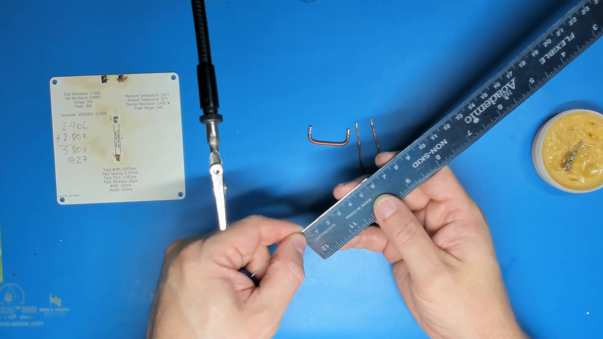

# Hotplate Setup

There are two main stages to setting up your new Aluminium PCB Hotplate. First you need to solder on
the power connections and the thermal fuse link. Once that is done, you need to mount it on a base and
connect the power leads to it.

## Bootstrapping and Backup!

The process below should be considered a bootstrapping process for setting up a hotplate PCB when you
don't already have one. If you already have a working PCB hotplate, you can use it to pre-heat your new
board to about 190°C and then you should be able to just solder the fuse link and power connections on
with a soldering iron. This is also the easiest way to rebuild the thermal fuse if you blow one, so it's
a good idea to set up at least two hotplates so if you do blow your thermal fuse, you have another one
on the shelf ready to go to repair the thermal fuse if you ever trip one. If your backup board isn't
calibrated, don't panic! For a 100x100mm aluminium hotplate PCB, constant power at 60W should provide
good preheat for soldering the fuse link back on. For hotplate PCBs of a different size, scale the power
level according to the area of your boards.

## Power Connections and Thermal Fuse Setup

For this stage of the setup you'll need the following items:

* An aluminium hotplate PCB
* A short piece of 10AWG or 6mm² **solid** copper wire (at least 50mm)
* A short piece of 14/16AWG or 1.5-2.5mm² **solid** copper wire (at least 160mm)
* A 3D printed bending jig (optional, but highly recommended)
* Pliers
* Wire cutters
* Soldering iron
* A ruler or some other measuring instrument that can measure up to 80mm
* High-temperature solder (preferably 0.8mm (0.031") flux-core wire)
* A mild, tacky solder flux (eg. NC191)
* A baking sheet
* Aluminium foil
* A kitchen oven

### Copper Wire

The wire can be salvaged out of domestic electrical cabling if you have access to off-cuts from a home
improvement project or maybe you have an electrician friend who might be able to find a few small off-cuts
for you.

The wire must be solid. For the fuse link, we need a solid mass that will pull away cleanly when the fuse
joints reflow. Stranded wire may not let go at all and be held in place by surface tension and adhesion
effects from the molten solder, rendering the thermal fuse useless. 10AWG or 6mm² is required to provide
sufficient mass to break away from the surface tension and adhesion of the molten solder.

For the power connections, solid wire is required to produce a rigid connection that won't move if the power
connection solder joints reflow in the event of a thermal fault. This is a safety feature to avoid live power
connections coming into contact with anything they shouldn't in the event of a thermal fault. 14AWG is not
entirely necessary, but it's a size that is relatively easy to find. 16AWG is probably sufficient for most
builds. Larger wire sizes (eg. the 10AWG you use for the fuse link) are not recommended for the power
connections. You will need to bend these into shape. 14AWG bends fairly easily, which reduces the stress on
the pads. Larger wires will be stiffer and place more stress on the adhesive holding the pads to the substrate
and could break the pads off of the hotplate PCB when bending them into place.

### Solder

The high temperature solder needs to be an alloy that melts at a significantly higher temperature than the
solder you intend to reflow. I recommend SN100C, CQ100Ge, K100LD or any similar alloys that are about 99.3%
tin and 0.7% copper with potentially other components like nickel and germanium. These are usually eutectic
alloys with a melting point of 227°C (441°F). The melting point is the most important aspect of the alloy
you use. Ideally you should use 0.8mm flux-core wire. Avoid solder paste. It's not suitable for the large
chunky joints we need here, will produce terrible results and may even damage your PCB.

Another potential alloy is 95/5 tin-antimony (SnSb) solder. It has a melting range between 232°C and 240°C.
This is a more desirable melting point and I have used this alloy extensively for years, however, two main
drawbacks which make this alloy more difficult to use. Firstly, it has poorer wetting and flow characteristics
which make getting good solder joints more challenging. You need to have plenty of heat and a good amount of
flux in place. Secondly, it's very difficult to find in sizes less than 1/8" (3.2mm), so pre-forming it around
your wires is out of the question and while solder cookies are a possibility, they simply don't reflow as
well and are much more difficult to get the volume right.

### Flux

I used to think there was no such thing as too much flux or a too aggressive flux. I was wrong. I've tried
a few different fluxes for setting up hotplate PCBs. NC191 from ChipQuik so far seems to have worked the
best. I've also tried SMD291 from ChipQuick and that was terrible. It is a more aggressive flux and is
excellent at clearing away oxides and other junk that prevents wetting and impedes flow, but for this purpose,
it also caused damage to the solder mask almost everywhere it flowed onto the board. These were JLCPCB boards.
Maybe other manufacturers use different solder mask that would be more resistant to this damage, so your
mileage may vary. There's nothing particularly special about NC191. I know it works, but I suspect that many
mid-range, no-clean tacky fluxes from a variety of manufacturers may work well.

Note that the PCB currently shown in the photos is one of these flux-damaged boards. I don't have any other
bare boards to use for the photos at this point. I'll re-shoot the images when I have new boards to set up.
It may be difficult to see since the images are all video frame-grabs, but if you do notice cracks or crazing
in the solder mask or exposed copper traces, this is why.

### Step 1. Cut the thermal fuse link

Using the gauge on the side of the bending jig, measure out 50mm of 10AWG solid copper wire. If you don't
have the bending jig, use a ruler instead to measure 50mm of the wire. Strip off the insulation if there
is any so you have a bare copper wire.

### Step 2. Bend the thermal fuse link into a shallow U shape

Insert one end of the thermal fuse link into the hole in the top of the bending jig and then bend the wire
down firmly until it is flat in the groove. Remove it and insert the other end into the hole and bend it
in the same way. Try to keep the two bend ends aligned.

If you don't have the bending jig you can also do this with a pair of pliers. Bend each end about 8mm from
the end. It doesn't have to be perfect. So long as the finished product has two ends that meet the thermal 
fuse pads and can meet the hotplate PCB roughly perpendicularly.

### Step 3. Check the thermal fuse link sizing

Place the thermal fuse link on the PCB alongside the thermal fuse pads in the centre of the board. If the
two ends don't align with the centres of both pads, use pliers to gently bend them a little more/less to
fix this. If the link doesn't lie flat when placed on a flat surface, then use pliers to twist the link a
little until the two ends are aligned.

### Step 4. Cut the power connection wires

Cut two 80mm pieces of 14AWG or 2.5mm² solid copper wire.

### Step 5. Tin both ends of the thermal fuse link and one end of each of the power connections.

Tin all wire ends that are to be soldered to the board. Use flux and plenty of heat. Use the same
high-temperature solder alloy you plan to use for soldering these wires to the hotplate PCB.  Make sure you
have a good solder bond all the way around the wires for about 4-6mm at the ends. The ends should now
look shiny and silver and ideally should not be noticeably thicker than they were before tinning. The
tinning should be a very thin and consistent layer over the surface of the copper.

### Step 6. Cut solder wire for pre-forming

Cut four 60mm pieces of your 0.8mm high-temperature solder wire. If you have solder wire with a different
thickness, adjust the length to give yourself the same approximate volume. 60mm of 0.8mm solder wire is
about 30mm³ of solder, so calculate the length required for that volume of solder. For example, with 1.5mm
solder, you'd only need about 17mm. Note that working with solder wire larger than 1.5mm is probably not
practical. It can be done using solder cookies rather than pre-forms, but the results are not as clean
and controlling the amount of solder in each joint becomes difficult.

### Step 7. Wrap the solder wire around each of the tinned wire ends

Take the 60mm pieces of solder wire and wrap one around each end of the thermal fuse link and one around
each of the tinned ends of the power connection wires. Keep the wraps as tightly together as possible and
keep the wraps to the final 4-6mm of the wire - basically where the solder is expected to be. If you can't
get it all wrapped around in a single layer, wrap the remainder around the outside in a second layer.

### Step 8. Create a stand for the thermal fuse link

The thermal fuse link needs to stand up perpendicular to the hotplate PCB. There are various ways to do this.
My preferred method is to get some thin wire (30AWG) and wrap it around the centre of the link a few times
leaving a loose end on either side. These can be bent down so as to provide a lightweight brace on either
side. Another option is loosely rolled aluminium foil, but it tends to be harder to remove if it gets stuck to
the board with flux residue. Thin wires tend to be easier to remove later. Whatever you use, it needs to be
collapsible to some degree. It cannot be a solid rigid object. When the solder joint freezes, it will still be
quite hot. As it cools, the solder and the copper wire contract, which will clamp down unbelievably hard on any
rigid object you place under the link. Ask me how I know this!

### Step 9. Line your baking sheet with aluminium foil

Line your baking sheet with aluminium foil to prevent any sticky flux residue from contaminating your next
batch of chicken wings or chocolate chip cookies. Try to ensure that all sides of the foil are turned up
at the edges so that no molten flux can flow off the side of the foil and onto the tray.

### Step 10. Place your hotplate PCB on the foil-lined baking sheet

What more to say? You can reflow multiple boards at the same time, so feel free to load it up with as many
hotplate PCBs as you want to set up.

### Step 11. Apply flux to the pads

Place a thin layer of tacky flux on each of the solder pads - the two thermal fuse pads and the two power
connection pads. Don't use too much. You'll just waste it and create more to clean up later. A thin layer
on the pads - enough that you can see the pad is covered and it will hold things placed on top of the pad,
but not a big bulging lump.

### Step 12. Apply flux to the solder pre-forms

On each of the wire ends to be soldered, place a small amount of flux on the side that will be at the top
of the joint - we want it to flow down through the pre-form as it melts in the oven. For the power
connections, just pick a side and place a thin line of tacky flux along that side and place that side facing
up when loading the board. For the thermal fuse, it stands perpendicular to the board, so put a small amount
just at the end of the solder wire wraps.

### Step 13. Place thermal fuse link and power connection on the hotplate PCB

Carefully lay the power connection wires with the pre-formed solder wire sitting centred on the each of the
power connection pads. The line of flux you placed on the end should be facing up.

Carefully place the thermalfuse link so that the two ends with solder wire pre-forms on them are sitting centred
on each of the thermal fuse pads and with the link standing up perpendicular to the hotplate PCB. If the link
is sitting over at an angle, it's not a major issue. In fact, lying at an angle may help increase the chance of
the fuse link breaking away in a thermal fault. Just make sure that the only place it is touching the PCB is at
the pad. We don't want any flux residue getting caught under the fuse link providing extra adhesion to the board.

### Step 14. Preheat your oven

Most domestic ovens will reach at least 250°C or 500°F. Preheat your oven to the highest temperature for baking
that it is capable of - probably something in the 250-280°C range or 500-550°F. Hotter is generally better, but
hotter than 280°C or 550°F is probably starting to get counter-productive. Why hotter? The solder needs to get
pretty hot to reflow and kitchen ovens aren't that fast at heating up things placed inside them. A hotter over
will transfer heat to the boards quicker, which is good because we need to reflow the solder before all the flux
cooks off. A colder oven might burn off all the flux before any solder melts, which could lead to poor quality
joints. Flux core wire can help with this, since it forces some of the flux to be retained inside the wire until
it melts. If you have a fan or convection feature in your oven, that is probably a good thing to use, but watch
that the air stream doesn't knock anything over or out of place. Also, preheating is crucial. Don't place your
boards in a cold oven thinking it will all work out the same. This will take longer to heat up your boards and
drastically increases the risk of burning off the flux before reflow is achieved.

### Step 15. Insert your baking sheet

Make sure you have good ventilation. It is a good idea to have a couple of windows open and to turn on your range
hood/exhaust fan/fume extractor/whatever you call the thing that sucks smoke and steam and stuff from your stove/oven
and ejects it outside. There is probably some smoke in your future!

Insert the baking sheet, turn on the oven light and watch. It will probably take a few minutes, but when the
solder reflows, it will be obvious. It will change from dull, greyish-white wire into shiny silver blobs.

### Step 16. Cool the PCBs in place

Once you can see that every single joint has reflowed, give it about another 30 seconds, then shut off the oven.
Open the oven door and leave the baking sheet to cool in place on the oven shelf/rack. There will probably be
smoke. Fans and exhaust fans are handy to have have at this point in the process. You may be tempted to move the
baking sheet elsewhere to cool, but this is risky. Every single joint is almost certainly still molten and moving
the baking sheet runs the risk of disturbing one or more of them, which could necessitate you repeating this
process or worse. Spilling hot molten solder on yourself or someone else is not fun. Give it 5-10 minutes. The
joints will have all frozen, things are probably cool enough to touch and you can take the baking sheet out with
confidence at that point.

### Step 17. Clean off any flux residue

Once the hotplate PCBs are cool, remove them from the oven and remove any flux residue from the hotplate PCBs
using isopropyl alcohol or a similar flux residue remover. Paper towels, cotton buds or an old toothbrush can
all be useful tools to use in wiping away the residue as the alcohol dissolves it. The toothbrush can be
particularly effective in getting the residue right at the edge of the pad.

This portion of the setup is now complete and you can move on to mounting the board on a base.

